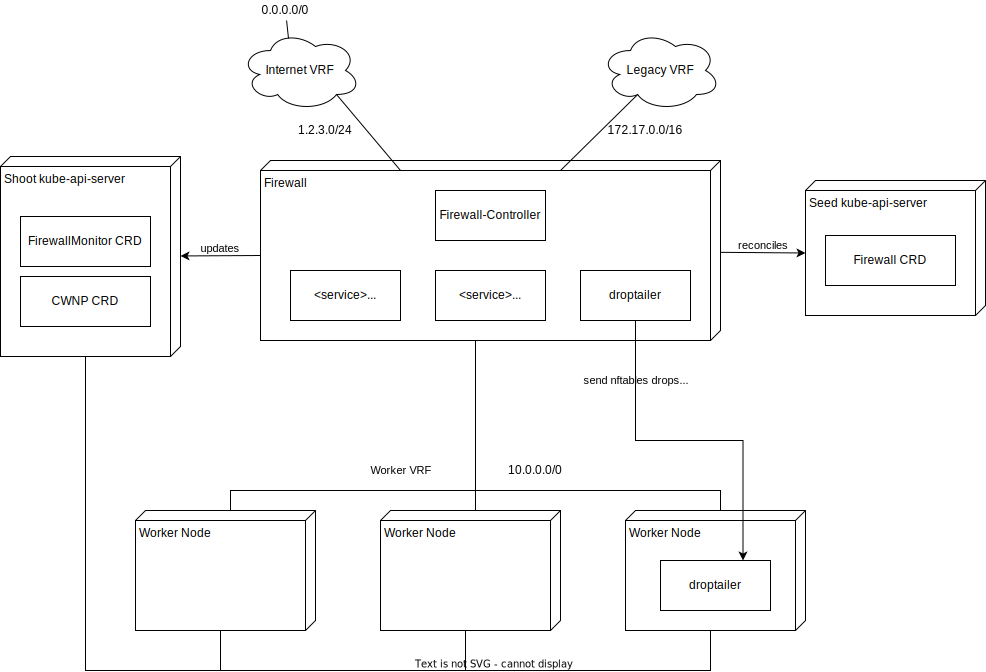

# firewall-controller

This controller is installed on a bare-metal firewall in front of several kubernetes worker nodes and responsible to reconcile a `ClusterwideNetworkPolicy` to nftables rules to control access to and from the kubernetes cluster.
It allows also to control the traffic rate going through, to limit network resources for restricted usage scenarios. Nftable and node metrics are exposed with the `nftables-exporter` and `node-exporter`, the ips are visible as service and endpoint from the kubernetes cluster.

Additionally, an IDS is managed on the firewall to detect known network anomalies. [suricata](https://suricata.io/) is used for this purpose. Right now, only basic statistics about the amount of scanned packets is reported. In a future release, access to all alarms will be provided.

This controller is typically setup through the [firewall-controller-manager](https://github.com/metal-stack/firewall-controller-manager) (FCM), which manages the lifecycle of metal-stack firewalls inside our [Gardener integration](https://docs.metal-stack.io/stable/overview/kubernetes/).

## Architecture

The firewall-controller is acting on 3 CRDs typically running in your cluster and a provider-managed cluster (in Gardener terms "shoot" and "seed").:

| CRD                              | API                          | Resides In | Purpose                                                             |
| -------------------------------- | ---------------------------- | ---------- | ------------------------------------------------------------------- |
| `ClusterwideNetworkPolicy`       | `metal-stack.io/v1`          | Shoot      | Controls firewall rules and can be provided by the user             |
| `Firewall` defined by FCM        | `firewall.metal-stack.io/v2` | Seed       | Defines the firewall including rate limits, controller version, ... |
| `FirewallMonitor` defined by FCM | `firewall.metal-stack.io/v2` | Shoot      | Used as an overview for the user on the status of the firewall      |

Note that `clusterwidenetworkpolicy` resources are namespaced and must reside in the `firewall` namespace, otherwise this controller does not reconcile them.



Example `ClusterwideNetworkPolicy`:

```yaml
apiVersion: metal-stack.io/v1
kind: ClusterwideNetworkPolicy
metadata:
  namespace: firewall
  name: clusterwidenetworkpolicy-sample
spec:
  egress:
  - to:
    - cidr: 1.1.0.0/24
      except:
      - 1.1.1.0/16
    - cidr: 8.8.8.8/32
    ports:
    - protocol: UDP
      port: 53
    - protocol: TCP
      port: 53
    - protocol: TCP
      port: 8080
      # Optional, if specified this is the way to specify a port range from port to endPort
      endPort: 8088
```

## Automatically Generated Ingress Rules

For every `Service` of type `LoadBalancer` in the cluster, the corresponding ingress rules will be automatically generated.

If `loadBalancerSourceRanges` is not specified, incomig traffic to this service will be allowed for any source ip addresses.

### DNS Policies Configuration

The `ClusterwideNetworkPolicy` resource allows you to define DNS based egress policies as well. They allow you to filter egress traffic based either on DNS name or by matching names to the provided pattern.

To filter by specific domain name you need to provide `matchName` field:

```yaml
apiVersion: metal-stack.io/v1
kind: ClusterwideNetworkPolicy
metadata:
  namespace: firewall
  name: clusterwidenetworkpolicy-fqdn
spec:
  egress:
  - toFQDNs:
    - matchName: example.com
    ports:
    - protocol: UDP
      port: 80
    - protocol: TCP
      port: 80
```

If you want to filter FQDNs that are matching certain pattern, you can use `matchPattern` field, which supports `*` wildcard. Following example allows traffic to port 80 of all resources in the `.example` top-level domain:

```yaml
apiVersion: metal-stack.io/v1
kind: ClusterwideNetworkPolicy
metadata:
  namespace: firewall
  name: clusterwidenetworkpolicy-fqdn-pattern
spec:
  egress:
  - toFQDNs:
    - matchPattern: *.example
    ports:
    - protocol: UDP
      port: 80
    - protocol: TCP
      port: 80
```

By default, DNS info is collected from Google DNS (with address 8.8.8.8:53). The preferred DNS server can be changed through the `Firewall` resource of the FCM, which is governed by the provider.

## Status

Once the firewall-controller is running, it will report several statistics to the `FirewallMonitor` CRD Status. This can be inspected by running:

```bash
kubectl get -n firewall fwmon
NAME                               MACHINE ID                             IMAGE                          SIZE            LAST EVENT    AGE
shoot--prod--seed-firewall-089f9   f4f8b200-deef-11e9-8000-3cecef22f910   firewall-ubuntu-2.0.20221025   n1-medium-x86   Phoned Home   18m
```

When showing the resource with `-o yaml`, it contains detailed information on traffic counting, package drops and IDS:

```yaml
Status:
  Last Run:  2020-06-17T13:18:58Z
  Stats:
    # Network traffic in bytes separated into external and internal in/out/total
    Devices:
      External:
        In:     91696
        Out:    34600
        Total:  0
      Internal:
        In:     0
        Out:    0
        Total:  2678671
    # IDS Statistics by interface
    Idsstats:
      vrf104009:
        Drop:              1992
        Invalidchecksums:  0
        Packets:           4997276
    # nftable rule statistics by rule name
    Rules:
      Accept:
        BGP unnumbered:
          Counter:
            Bytes:    0
            Packets:  0
        SSH incoming connections:
          Counter:
            Bytes:    936
            Packets:  16
        accept established connections:
          Counter:
            Bytes:    21211168
            Packets:  39785
        accept icmp:
          Counter:
            Bytes:    0
            Packets:  0
        accept traffic for k8s service kube-system/vpn-shoot:
          Counter:
            Bytes:    360
            Packets:  6
      Drop:
        drop invalid packets:
          Counter:
            Bytes:    52
            Packets:  1
        drop invalid packets from forwarding to prevent malicious activity:
          Counter:
            Bytes:    0
            Packets:  0
        drop invalid packets to prevent malicious activity:
          Counter:
            Bytes:    0
            Packets:  0
        drop packets with invalid ct state:
          Counter:
            Bytes:    0
            Packets:  0
        drop ping floods:
          Counter:
            Bytes:    0
            Packets:  0
      Other:
        block bgp forward to machines:
          Counter:
            Bytes:    0
            Packets:  0
        count and log dropped packets:
          Counter:
            Bytes:    2528
            Packets:  51
        snat (networkid: internet):
          Counter:
            Bytes:    36960
            Packets:  486
```

## Prometheus Integration

There are two exporters running on the firewall to report essential metrics from this machine:

- node-exporter for machine specific metrics like cpu, ram and disk usage, see [node-exporter](https://github.com/prometheus/node_exporter) for details.
- nftables-exporter for nftables metrics, see [nftables-exporter](https://github.com/Sheridan/nftables_exporter)

Both exporters are exposed as services:

```bash
kubectl get svc -n firewall
NAME                TYPE        CLUSTER-IP   EXTERNAL-IP   PORT(S)    AGE
nftables-exporter   ClusterIP   None         <none>        9630/TCP   13h
node-exporter       ClusterIP   None         <none>        9100/TCP   13h
```

These services are in front of virtual endpoints:

```bash
kubectl get ep -n firewall
NAME                ENDPOINTS         AGE
nftables-exporter   10.3.164.1:9630   13h
node-exporter       10.3.164.1:9100   13h
```

You can scrape these services in you prometheus installation to get the metrics.

To check you can run:

```bash
curl nftables-exporter.firewall.svc.cluster.local:9630/metrics
curl node-exporter.firewall.svc.cluster.local:9100/metrics
```

## Firewall Logs

It is also possible to tail for the dropped packets with the following command (install stern from [stern](https://github.com/stern/stern)):

```bash
stern -n firewall drop
```

The output will look like:

```json
droptailer-6d556bd988-4g8gp droptailer 2020-06-17 13:23:27 +0000 UTC {"ACTION":"Drop","DPT":"4000","DST":"1.2.3.4","ID":"54321","IN":"vrf104009","LEN":"40","MAC":"ca:41:f9:80:fa:89:aa:bb:0e:62:8c:a6:08:00","OUT":"vlan179","PREC":"0x00","PROTO":"TCP","RES":"0x00","SPT":"38464","SRC":"2.3.4.5","SYN":"","TOS":"0x00","TTL":"236","URGP":"0","WINDOW":"65535","timestamp":"2020-06-17 13:23:27 +0000 UTC"}
droptailer-6d556bd988-4g8gp droptailer 2020-06-17 13:23:34 +0000 UTC {"ACTION":"Drop","DPT":"2362","DST":"1.2.3.4","ID":"44545","IN":"vrf104009","LEN":"40","MAC":"ca:41:f9:80:fa:89:aa:bb:0e:62:8c:a6:08:00","OUT":"","PREC":"0x00","PROTO":"TCP","RES":"0x00","SPT":"40194","SRC":"2.3.4.5","SYN":"","TOS":"0x00","TTL":"242","URGP":"0","WINDOW":"1024","timestamp":"2020-06-17 13:23:34 +0000 UTC"}
droptailer-6d556bd988-4g8gp droptailer 2020-06-17 13:23:30 +0000 UTC {"ACTION":"Accept","DPT":"650","DST":"1.2.3.4","ID":"12399","IN":"vrf104009","LEN":"40","MAC":"ca:41:f9:80:fa:89:aa:bb:0e:62:8c:a6:08:00","OUT":"vlan179","PREC":"0x00","PROTO":"TCP","RES":"0x00","SPT":"40194","SRC":"2.3.4.5","SYN":"","TOS":"0x00","TTL":"241","URGP":"0","WINDOW":"1024","timestamp":"2020-06-17 13:23:30 +0000 UTC"}
droptailer-6d556bd988-4g8gp droptailer 2020-06-17 13:23:34 +0000 UTC {"ACTION":"Accept","DPT":"2362","DST":"1.2.3.4","ID":"44545","IN":"vrf104009","LEN":"40","MAC":"ca:41:f9:80:fa:89:aa:bb:0e:62:8c:a6:08:00","OUT":"","PREC":"0x00","PROTO":"TCP","RES":"0x00","SPT":"40194","SRC":"2.3.4.5","SYN":"","TOS":"0x00","TTL":"242","URGP":"0","WINDOW":"1024","timestamp":"2020-06-17 13:23:34 +0000 UTC"}
droptailer-6d556bd988-4g8gp droptailer 2020-06-17 13:23:10 +0000 UTC {"ACTION":"Accept","DPT":"63351","DST":"1.2.3.4","ID":"11855","IN":"vrf104009","LEN":"40","MAC":"ca:41:f9:80:fa:89:aa:bb:0e:62:8c:a6:08:00","OUT":"vlan179","PREC":"0x00","PROTO":"TCP","RES":"0x00","SPT":"54589","SRC":"2.3.4.5","SYN":"","TOS":"0x00","TTL":"245","URGP":"0","WINDOW":"1024","timestamp":"2020-06-17 13:23:10 +0000 UTC"}
droptailer-6d556bd988-4g8gp droptailer 2020-06-17 13:23:51 +0000 UTC {"ACTION":"Accept","DPT":"8002","DST":"1.2.3.4","ID":"17539","IN":"vrf104009","LEN":"40","MAC":"ca:41:f9:80:fa:89:aa:bb:0e:62:8c:a6:08:00","OUT":"","PREC":"0x00","PROTO":"TCP","RES":"0x00","SPT":"47615","SRC":"2.3.4.5","SYN":"","TOS":"0x08","TTL":"239","URGP":"0","WINDOW":"1024","timestamp":"2020-06-17 13:23:51 +0000 UTC"}
```

You can forward the droptailer logs to any log aggregation infrastructure you have in place.

If enabled in the firewall spec, accepted connections can be logged in addition to dropped connections.
